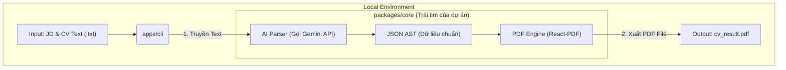

# Kiến trúc Hệ thống

Dự án sử dụng phương pháp **Monorepo** để đảm bảo khả năng tái sử dụng code cốt lõi khi nâng cấp từ một công cụ chạy trên máy tính (Local MVP) lên một hệ thống Website SaaS.

## 1. Cấu trúc Thư mục (Dự kiến)

```text
CV-Generator/
├── packages/
│   └── core/            # Lõi hệ thống (Không chứa logic UI hay API Server)
│       ├── types/       # Định nghĩa AST Schema (Interfaces)
│       ├── ai/          # Logic gọi Google Gemini API
│       └── renderer/    # Các component React vẽ file PDF (@react-pdf)
├── apps/
│   └── cli/             # App Node.js gọi 'core' để chạy test ở môi trường Local
└── docs/                # Tài liệu hệ thống
```

## 2. Sơ đồ Luồng (Data Flow) - Giai đoạn MVP



## 3. Kiến trúc Mở rộng (Tương lai)
Khi nâng cấp lên Web App, ta chỉ cần tạo thêm thư mục `apps/web` (Next.js/Vite) và import trực tiếp thư mục `packages/core` để sử dụng lại toàn bộ engine mà không cần code lại.
