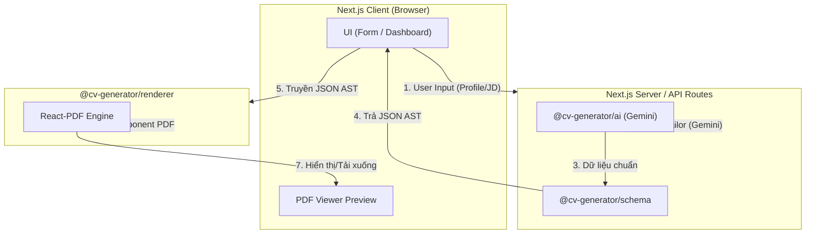
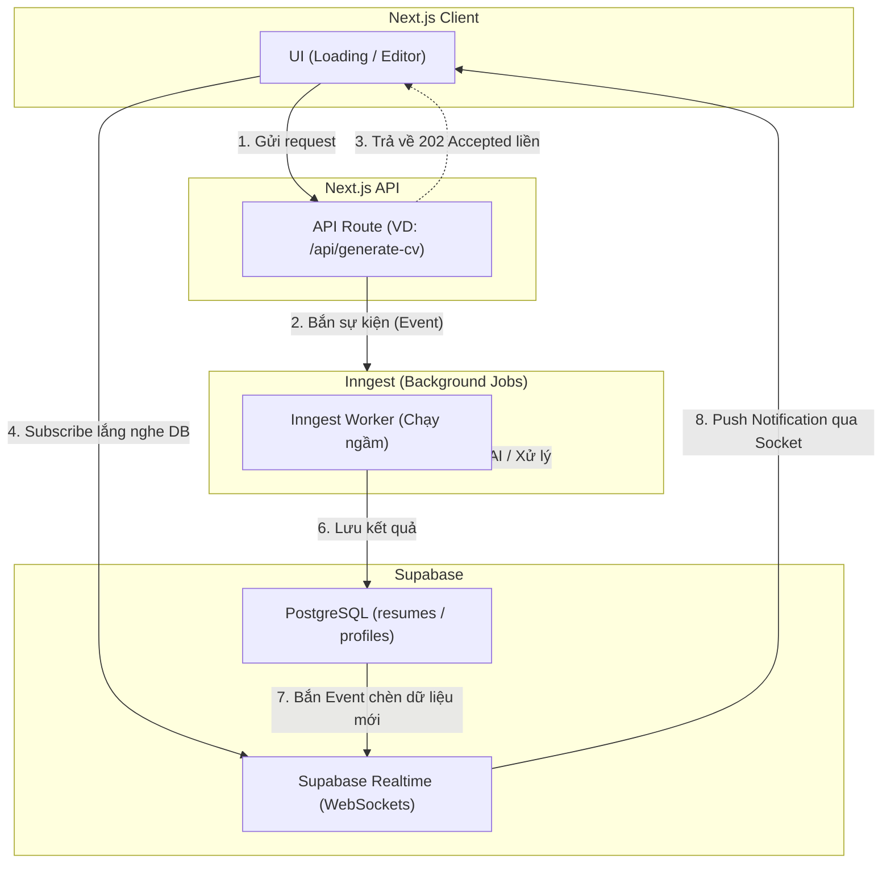

# Kiến trúc Hệ thống SaaS

Dự án sử dụng phương pháp **Lego-style Monorepo** để đảm bảo khả năng tái sử dụng code tốt nhất, hỗ trợ Next.js App Router (phân chia Server/Client rõ ràng) và tránh các lỗi Tree-Shaking.

## 1. Cấu trúc Thư mục

```text
CV-Generator/
├── packages/              # Lõi hệ thống (Tách thành các khối Lego)
│   ├── schema/            # Định nghĩa AST Schema (Zod/Interfaces). Độc lập hoàn toàn.
│   ├── ai/                # Logic gọi Google Gemini API (Chỉ chạy trên Server). Phụ thuộc schema.
│   └── renderer/          # Các component React vẽ file PDF (@react-pdf). Phụ thuộc schema.
├── apps/
│   ├── cli/               # App Node.js gọi các packages để chạy test ở môi trường Local.
│   └── web/               # Next.js Web App SaaS UI (App Router, shadcn/ui).
└── docs/                  # Tài liệu hệ thống
```

## 2. Sơ đồ Luồng (Data Flow) - Kiến trúc SaaS



## 3. Lý do Tách Gói (Lego-style)
Kiến trúc nguyên khối `packages/core` (cũ) gặp vấn đề khi Next.js cố gắng compile các thư viện Backend (như `@google/generative-ai` hoặc `fs`, `path`) vào Client bundle khi sử dụng chung với `@react-pdf/renderer` (chạy trên Client).

Bằng cách tách thành 3 gói riêng biệt:
- Giao diện Client chỉ việc import `@cv-generator/schema` (nhẹ) và `@cv-generator/renderer` (chỉ phụ thuộc React).
- API Server sẽ import `@cv-generator/schema` và `@cv-generator/ai` để gọi Gemini một cách an toàn.
- Ngăn chặn hoàn toàn lỗi môi trường và rò rỉ API Keys.

## 4. Kiến trúc Async (Background Jobs & Realtime)

Để giải quyết giới hạn Timeout của Vercel (10s - 60s) khi gọi AI và xử lý các tác vụ nặng (Sinh CV, Parse PDF), hệ thống sẽ áp dụng mô hình Queue & Realtime chuẩn Enterprise:



### Ưu điểm của mô hình này:
- **Chống Timeout:** API không còn phải đợi (await) AI gen xong. Trình duyệt nhận được phản hồi ngay lập tức (Non-blocking).
- **Trải nghiệm Realtime (UX):** Không sử dụng Short-polling (Fetch liên tục gây quá tải). Trình duyệt kết nối Socket tới Supabase và nhận thông báo ngay đúng giây phút CV được tạo xong.
- **Tính khả thi mở rộng (Scalability & Prioritization):** Khi lưu lượng truy cập lớn, Queue (Inngest) sẽ giúp xếp hàng các yêu cầu. Dễ dàng triển khai logic: User Premium được ưu tiên xử lý trước, User Free chờ khi rảnh rỗi.
